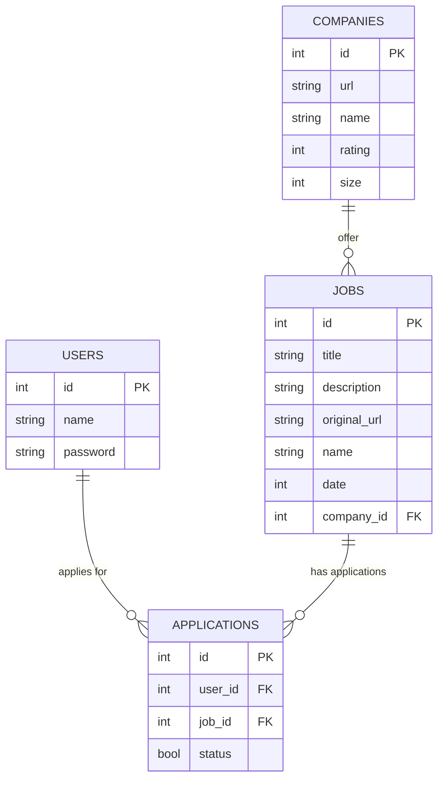
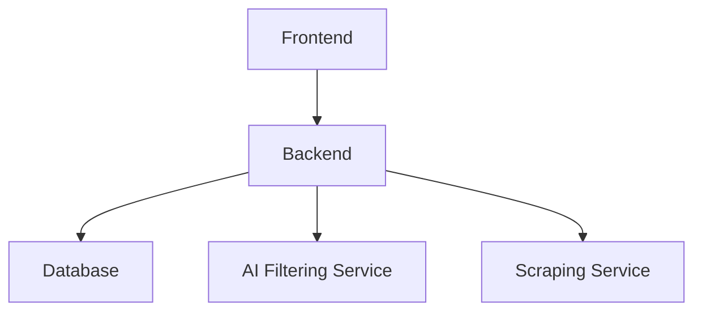

# JobFilter

Search job offers with advanced filter. 

## Installation

1. Create env

2. Install poetry
```bash
pip install poetry
```

3. Install dependencies
```bash
poetry install && poetry run setup
```

4. Install ollama: https://ollama.com/download

**Note**: substitute poetry with uv (seems better)

## Run

Run with:

```python
python src/jobfilter/search.py --file data/fake_ml_engineer_cv.pdf
```

## Features

Input:
- CV

Processing:
- search phase: search from job websites leaveraging their filters
- filtering phase: indexing + ai filter

Output:
- list of relevant job offers

<!-- Things to check in the job offer:
- english language
- no internship
- no startup / company size > 50
- no senior role (except for entry senior)
- check if it's truly fully remote -->

## Behavior 2: collector + filter

### collector

Collect all recent job offers and the corresponding company. Specify a particular sector to avoid scraping too much stuff?

Important things to collect for each job offer:
- (id)
- original url (usually website): unique but could be none
- name
- company
- date of the offer (autmatically delete too old job offers, like 1-3 months old)
- submitted true/false (? clicking submit button will trigger it)
- other common structured data
Matching: through original url or fuzzy matching name + company (and text).

Important things to collect from companies:
- (id)
- website url as id (the only unique identifier)
- name
- size
- rating (from glassdoor / indeed)

Where to scrape? From job portals or from the whole internet company websites?

How to store documents? As they are? Extracting specific info? Using embedding vectors? Use a database specifically designed for both scraping and RAG, maybe there is something ready (without using standard databases)...

### filter

Input:
- requirements text (even CV text)

Processing:
- Search prase: generate a search phrase based on requirements
- filtering phrase:
    1. structure retrieval: using llm to generate rules / sql
    2. unstructure indexing: using sentence transformer (or similar)

Output:
- list of relevant job offers

## Database schema



## Architercure



## Versions

This project is not small so let's give it a priority to task, and make versions:

1. Minimal working tool
- Database: only jobs (postgres + pgvector)
- Ranking: only embedding llm (llamaindex + langchain)
- Scraping: use jobspy (recurrent)
- Frontend: simple streamlit dashboard
- Deploy: place everything on cloud (with working link)

2. Add companies:
- Scraping: retrieve company info (like score)
- Database: add companies
- Ranking: filter by bad score

3. Add structured metadata:
- Database: add metadata field
- Database: add second database to replace pgvector (like qdrant)
- Ranking: add model to extract structured data

4. Trainings...
- distill big model to small one
- add feedback system?
- training embedding llm model


