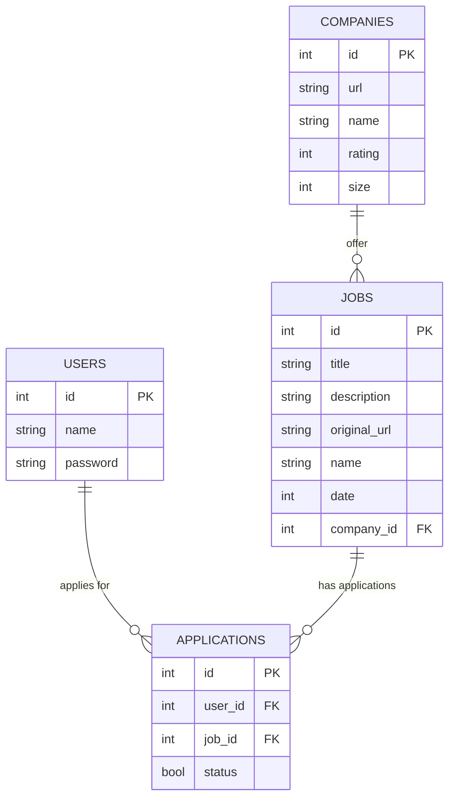
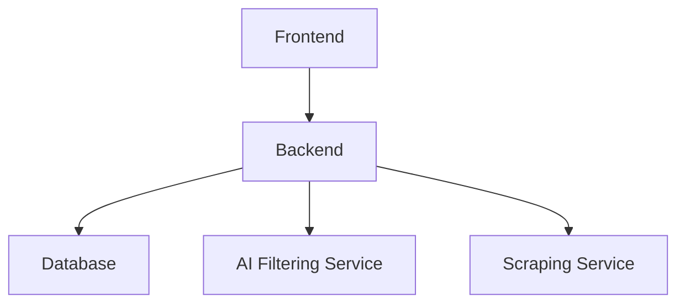

# JobFilter
Search job offers with advanced filter

## Installation

1. Create env

2. Install poetry
```bash
pip install poetry
```

3. Install dependencies
```bash
poetry install
```

## Behavior

Input:
- CV

Processing:
- search phase: search from job websites leaveraging their filters
- filtering phase: indexing + ai filter

Output:
- list of relevant job offers

<!-- Things to check in the job offer:
- english language
- no internship
- no startup / company size > 50
- no senior role (except for entry senior)
- check if it's truly fully remote -->

## Behavior 2: collector + filter

### collector

Collect all recent job offers and the corresponding company. Specify a particular sector to avoid scraping too much stuff?

Important things to collect for each job offer:
- (id)
- original url (usually website): unique but could be none
- name
- company
- date of the offer (autmatically delete too old job offers, like 1-3 months old)
- submitted true/false (? clicking submit button will trigger it)
- other common structured data
Matching: through original url or fuzzy matching name + company (and text).

Important things to collect from companies:
- (id)
- website url as id (the only unique identifier)
- name
- size
- rating (from glassdoor / indeed)

Where to scrape? From job portals or from the whole internet company websites?

How to store documents? As they are? Extracting specific info? Using embedding vectors? Use a database specifically designed for both scraping and RAG, maybe there is something ready (without using standard databases)...

### filter

Input:
- requirements text (even CV text)

Processing:
- Search prase: generate a search phrase based on requirements
- filtering phrase:
    1. structure retrieval: using llm to generate rules / sql
    2. unstructure indexing: using sentence transformer (or similar)

Output:
- list of relevant job offers

## Tools

Interesting links:
- https://github.com/AIHawk-co/Auto_Jobs_Applier (automatic job aplly)
- https://github.com/topics/jobsearch

LLMs:
- https://github.com/langchain-ai/langchain (llm pipelines)
- https://github.com/deepset-ai/haystack (llm pipelines)

Scrapers:
- https://github.com/Bunsly/JobSpy (search job offers)
- https://github.com/Nv7-GitHub/googlesearch (google search)
- https://github.com/alirezamika/autoscraper
- https://github.com/joeyism/linkedin_scraper (linkedin person or company scraper, it requires chrome and an email-password)
- selenium

Database:
- PostgreSQL (better)
- MongoDB
- airflow

Vector indexing:
- qdrant
- elasticsearch

Simple NLP libraries:
- re
- spacy
- nltk / gensim
- RapidFuzz
- langdetect

## Ideas

Things done:
- DONE add try except for scrapers since they don't work all the time
- DONE company info: linkedin scraper opensource (hard!), linkedin scraper API (fee), crunchbase scraper, google scraper "<company_name> number of emplyees", ...?
- DONE run llm locally (done with huggiface slow and ollama fast since it uses 4bit llama3.2-3b)

Next things to do (priority order):
- Move search query creation before the scraper
- Execute script and see if scrapers work propery
- Add search: search query manual or add a file description of what the user is searching
- Use a more powerful model (explore APIs, on demand is better)
- split collecting from searching: first collect job offers and companies in a database (like postgres) and then search them through a RAG
- advanced scraper with a LLM agent? is it possible?
- explore more search libraries
- add a searching company tools on the internet (like AI companies in Germany)

Ideas on LLMs:
- knowledge distillation (from gpt4o to small model specific for job offers data extraction)
- embedding LLM finetuning with feedback implementation (good/bad suggestion)
- using efficient training (q)lora
- cutting cost option: use llm to create rule based filtering and execute rules only
- instruction fine-tuning: train llm to extract structured information (eg. salary range, remote, ...)
- estimate of salary when missing (like llm to extract common data and xgboost to predict salary?)
- to extract structured data: prompting (returning json), semantic / classification tagging (similar to NER) with finetuning or fewshot or zeroshot
- to extract user input: ...

Ideas on storage and retrieval:
- store the plain text (cleaned)
- extract and store specific data (remote?, company name, ...): postgres jsonb
- extract and store the embedding
- what to use: embedding or rules? both to see if we can use hybrid. How? First use sql / rules to do a first filtering then use embedding to rank filterd documents

Additional things (maybe out of scope):
- store job offers or applied jobs or companies better?
- cover letter creation?
- autoapply?

## Database schema



## Architercure



## Versions

This project is not small so let's give it a priority to task, and make versions:

1. Minimal working tool
- Database: only jobs (postgres + indexing tool)
- Ranking: only embedding llm
- Scraping: use jobspy (recurrent)
- Frontend: simple streamlit dashboard
- Deploy: place everything on cloud (with working link)

2. Add companies:
- Scraping: retrieve company info (like score)
- Database: add companies
- Ranking: filter by bad score

3. Add structured metadata:
- Database: add metadata field
- Ranking: add model to extract structured data

4. Trainings...
- distill big model to small one
- add feedback system?
- training embedding llm model


